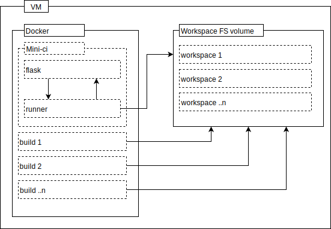

# About this project

This is just a simple app where I experiment with creating a simple
CI/CD tool using docker, makefiles, and python.

(CI/CD means Continuous Integration / Continuous Delivery)

# Why another CI / CD Project?

Good question! I've setup production deployments of Jenkins, Drone, and some 
other hosted services. They work well, and I have few complaints. However, I 
do see that while you can build and test docker images in isolation, few of 
current crop of CD/CD tools offer a direct way to simply use `docker-compose`
and Makefile as task runners. 

Many of the tools offer lots of abstractions which, when configured properly
will stand up robust, reliable, and information-rich services. 

# Goals of the project

  1. Learn CI/CD from the ground-up using technologies I like best. (Currently Python and docker)
  2. Test environments using `docker-compose` and `Makefile` as task runners
  2. Use this CI/CD system in production for all of my side projects
  3. Have a tool that requires as little resources as possible (Depending on the tests)
  4. Use CI/CD without learning another DSL, configuration format, or programming language. (This is subjective, I guess)

# Logical layout



# Getting started

## 1. Create .env (Configure environment variables)
Copy the `env.sample` to `.env` in this folder. Open the `.env` file in a 
text editor.

  1. Configure a SSH key so that the CI container can pull/push git repos.
See the comments in the `env.sample` file
  2. Configure `DOCKER_USER` and `DOCKER_PASS` if you are pushing docker images
  to docker hub.

**TODO**: Perhaps create a Makefile target this will kick this off.

## 2. Create settings.py (Project configuration file)
Copy `settings.sample` to `settings.py`. This is the "database" for configuring
the various projects that mini-ci will build. Things such as:

  - Code repo URL
  - Notifications
  - Deploy keys

**TODO**: Create a Makefile target that sets this up

### How to use this file

The root keys in the settings variables must match the webhook uri.
That means that when a webhook post comes in github to
http://youserver/webhook/project_1, then settings must look
something like this:

```
settings = {
    "project_1": {
        "GIT_REPO": "http://github.com/username/reponame.git"
        "OPTIONAL_ENV_1": "test123",
        "OPTIONAL_ENV_2": "hahahaha"
    },
}
```

These settings will be imported into the build runners as environment
variables. That means that GIT_REPO will be accesses as
$GIT_REPO in the bash commands and makefile.

Required keys:
    - GIT_REPO

## Put a Makefile in your project and define a 'ci-build' target

Mini-ci will attempt to run a `Makefile` from the root folder of you
source code. In that Makefile you must define You must define the 
`ci-deploy` target in your makefile for the runner to do its job. 

This is a hard-coded requirement at the moment.

The `Makefile` will have access to the environment variables that come
from your project's configuration in settings.py. See the comments in the
Makefile sourcecode to see how they are used.

Please take note how this Makefile uses environment variables from 
`settings.py` which are used in naming and tagging docker images as
well as instructing the production environment (dokku server) to update
code with new docker images.

Have a look in the `examples/` folder to see how you might use it


# Other important things you need to know

## Security is not a primary goal on this project

**Be advised!** This project requires running docker images with access
to the docker socket (`/var/run/docker.socket`). You should therefore
only run this app in a trusted environment.


